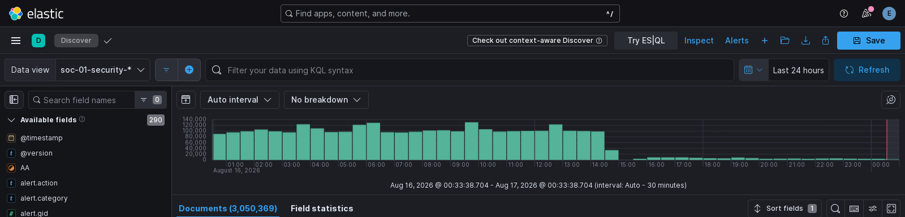

# Enterprise Security Operations Center (SOC) Infrastructure

## Overview
Designed and deployed a comprehensive, defense-in-depth security monitoring infrastructure on bare-metal hardware for continuous threat detection and incident response capabilities.

## Business Challenge
- Need for 24/7 security monitoring across distributed network
- Real-time threat detection and correlation
- Scalable log aggregation and analysis
- Zero reliance on cloud services for sensitive data

## Technical Architecture

### Hardware Infrastructure
- **Server**: Custom-built i9-13900K/128GB RAM system (24 cores / 32 threads)
- **Storage**: Elasticsearch index data on a RAID1 pair of spinning disks, NVMe for the OS, a separate disk for snapshot archives
- **GPU**: AMD RX 7900 XTX with ROCm acceleration
- **Network**: Firewalla Gold Pro managing multiple VLANs with port mirroring

### Core Components

#### 1. SIEM Platform (ELK Stack)
- **Elasticsearch 8.19.19**: 307M Suricata and Zeek events across 118 GB
- **Logstash**: Multi-pipeline ingestion from 6+ sources
- **Kibana 8.19.19**: Custom dashboards for security operations
- **Cluster Total**: 6.09B documents and 1.51 TB across 443 indices. Network telemetry is 5% of that; the rest is Elastic Defend endpoint data.
- **Data Volume**: ~1.5M network security events/day; ~41M endpoint telemetry events/day from Elastic Defend
- **Index Strategy**: ILM rollover behind the `soc-security-write` alias (replaced daily `soc-security-YYYY.MM.DD` indices in July 2026, cutting the cluster from 814 to 589 shards)

#### 2. Network Security Monitoring
- **Suricata 7.0.3**: 44,983 threat signatures, IDS mode
- **Zeek**: Full packet analysis, protocol dissection
- **Coverage**: All network traffic via managed switch port mirroring
- **Detection**: Real-time JSON event streaming to ELK

#### 3. Endpoint Detection & Response
- **Velociraptor 0.75.1**: Centralized EDR server
- **Agents**: 3 endpoints (Windows 11, Linux systems)
- **Capabilities**: Live forensics, hunt deployment, artifact collection
- **Integration**: Direct data feed to Elasticsearch

#### 4. Threat Intelligence
- **Sources**: VirusTotal, AbuseIPDB, AlienVault OTX, Hybrid Analysis
- **Correlation**: Automated IOC enrichment in ELK
- **Custom Detections**: DNS behavioral analysis, DGA detection

### Security Monitoring Capabilities

#### DNS Behavioral Analysis
- DGA (Domain Generation Algorithm) detection
- DNS tunneling identification  
- Suspicious TLD monitoring
- Scoring system (50+ logged, 80+ alerted)
- Real-time Pushover notifications

#### Automated Response
- Custom Python automation for alert triage
- Velociraptor hunt deployment
- AI-enhanced analysis using Ollama with Mistral 7B
- RAG system with MITRE ATT&CK framework integration

## Data Scale & Performance

### Current Metrics (measured 2026-08-08)
- **Cluster Total**: 6.09B documents, 1.51 TB across 443 indices
- **Network Telemetry**: 307M Suricata and Zeek events in 118 GB — `soc-security-*`, 5% of the cluster
- **Endpoint Telemetry**: 4.81B Elastic Defend events in 1.21 TB across 3 hosts, dominated by file events
- **Daily Throughput**: ~1.5M network security events/day, ~41M endpoint events/day
- **Zeek 24-hour sample**: 243,971 connection and 625,943 DNS records
- **Availability**: systemd-managed services with automatic restart
- **Ingest Ceiling**: ~6.3K docs/sec on bulk work, bounded by the spinning-disk array rather than CPU or memory

### Index Management
```
soc-security-*:       307M events (Suricata + Zeek), ILM rollover
logs-endpoint.events.*: 4.81B events (Elastic Defend)
velociraptor-hunts-*:   EDR collections
```

Endpoint telemetry dominates the cluster: `logs-endpoint.file` alone is 3.99 billion
documents in 624GB, which makes file-event retention the largest single lever on
cluster size.

## Advanced Features

### AI-Enhanced Analysis
- Local LLM (Mistral 7B for triage, Mistral Small 22B as overseer) for log analysis
- RAG system with security knowledge base
- Automated threat classification
- Alert prioritization

### Automated Reporting
- TTX (Tabletop Exercise) report generation: 3 minutes
- IR assessment creation: 20 minutes  
- Previously manual, at 4-8 hours per document

## Technical Skills Demonstrated
- Enterprise SIEM deployment & tuning
- Network security monitoring (NSM)
- Endpoint detection & response (EDR)
- Threat intelligence integration
- Linux system administration
- Docker containerization
- Python automation & scripting
- GPU acceleration (ROCm)
- Log analysis & correlation
- Incident response workflows
- Infrastructure as code

## Business Impact
- **Threat Detection**: Real-time visibility across the entire network
- **Response Time**: Alert triage and hunt deployment run without analyst intervention
- **Cost**: Self-hosted on owned hardware, with no per-GB ingest licensing
- **Compliance**: Complete audit trail for forensics
- **Scalability**: Headroom is constrained by disk throughput, which is the documented next upgrade

## Screenshots



*Kibana Discover across the security indices — 3,050,369 documents in a rolling
24 hours, 290 mapped fields. The gap after 14:00 is an ingest pause, not a
rendering artefact.*

Host names are rewritten and the document table is cropped out before capture:
raw records carry internal addressing and device names, and a screenshot is the
one artefact a text sanitisation pass cannot reach.

The dated figures in the telemetry strip on the [site homepage](https://seriouslycyberllc.github.io/cyber-portfolio/)
are regenerated directly from the cluster by `scripts/update-telemetry.mjs`, and
are better evidence than any screenshot — reproducible, timestamped, and not
hand-composed.

---

**Built**: September 2025 - January 2026  
**Status**: Production, 24/7 operation  
**Environment**: Bare-metal, self-hosted
